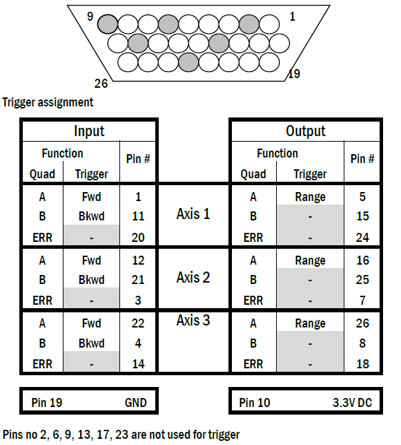

MK3-PLL
^^^^^^^^

`MK3-PLL <https://www.softdb.com/scanning-probe-microscopy/mk3-pll/>`_ is a general-purpose, open-source SPM controller and phase-locked loop newly developed by SoftdB. It is fully compatible with the GXSM software and can be used for most SPM control tasks. The hardware features 8 AC analog I/Os with :math:`\pm 10~V` input and output voltage ranges, up to 150 kHz adoption frequency, 10 MHz input bandwidth, and 80 kHz output bandwidth. Two 16-bit counter inputs are synchronized with analog samples. They can be used as pulse counters or quadrature encoder pulse (QEP) counters. The 16 configurable GPIOs can be used to interface with the ANC350 to control the movement of the translation stage. The low noise and high DC stability of the MK3-PLL are essential for SPM scanning. Finally, through the high-speed USB interface, it can be connected to a PC and control the scanning and acquisition of imaging data in real-time via the PC.

The official manual can be found `here <https://www.softdb.com/_files/_dsp_division/SPM_PLL_UsersManual.pdf>`_.

Get started with MK3-PLL
---------

Update the GXSM firmware
>>>>>>>>>

If this is your first time using the MK2-A810 or MK3-PLL SPM controller, you will need to connect it to a Windows PC and update the GXSM firmware before using it, refer to this `manual <https://github.com/necoxt/NearField/raw/master/downloads/SPMController_Firmware_Update.pdf>`_ for details.

After you flash the GXSM firmware to the controller, you need to reboot the controller at least once. The steps are: power off, wait for 5 seconds -> power on, wait for 5 seconds -> connect the USB cable with your Ubuntu PC.

To check if the kernel driver has been loaded properly: run ``dmesg | grep usb``, the MK module should be listed.

Connect MK3-PLL with Attocube ANC350
---------

The ANC350 controller is an open and closed loop positioning and scanning controller, allowing the simultaneous operation of up to three piezo-driven positioners and/or scanners. The manual of ANC350 can be found `here <https://github.com/necoxt/NearField/raw/master/downloads/Manual_ANC350_v4.0.3.pdf>`_.

We use the MK3-PLL to send trigger signals to the ANC350 to control the attocube translation stages. In principle, we can use the GPIO of MK3-PLL to output the trigger signal to the GPIO of ANC350, however, we found that the output of MK3-PLL's GPIO is not as expected. We adopt a more direct approach by directly connecting ZO(3) on the front panel of MK3-PLL to the GPIO of ANC350 for auto-approaching. Depending on the translation stage connection, select the correct gpio pin to input the trigger signal (you can test it with a waveform generator beforehand.) The ANC350 GPIO pin settings are as follows:

.. warning:: 
   ANC350 uses LVTTL logic operating at a maximum Voltage of 3.3V. Do not input a trigger signal that exceeds this voltage range.